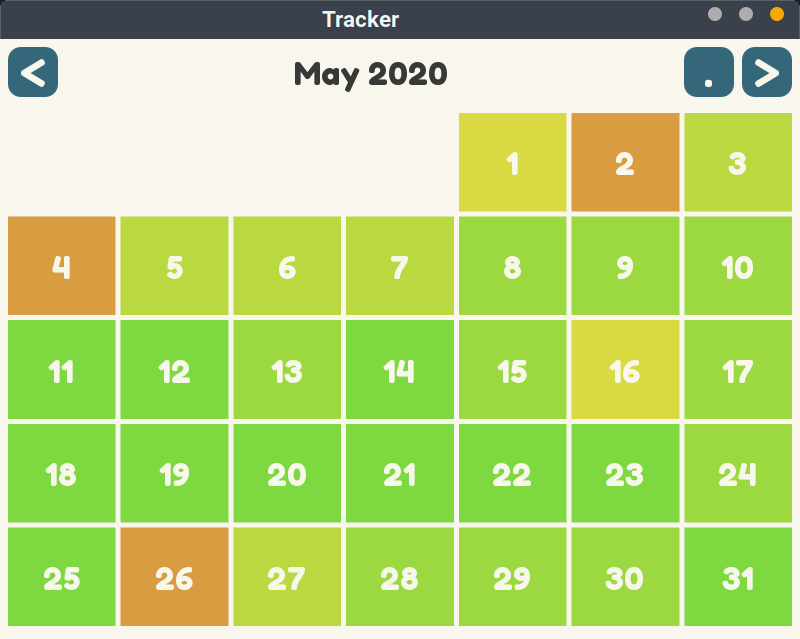
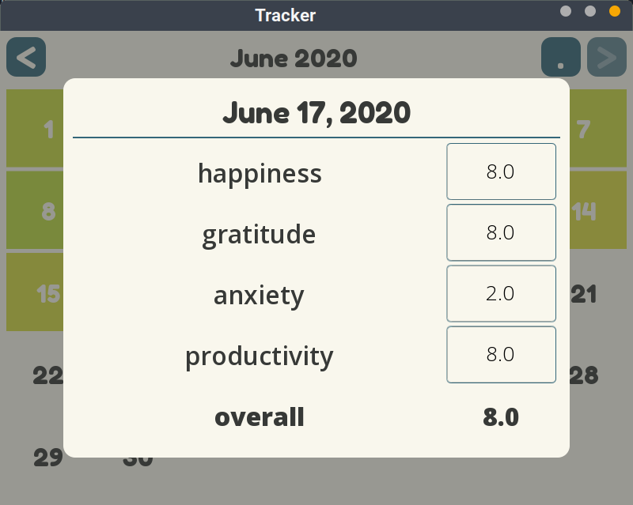
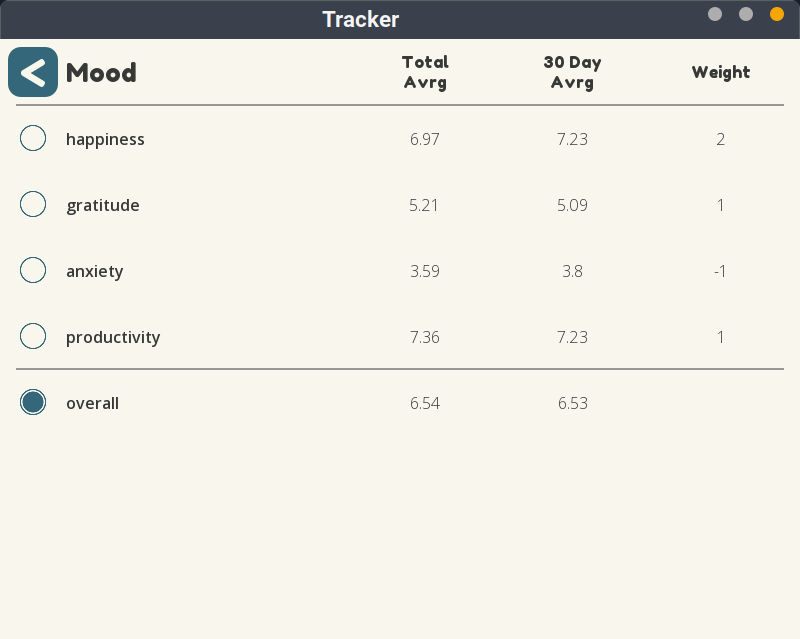

## Mood Tracker Interface Information 

The mood tracker displays daily moods in a calendar:

It tracks multiple moods, and clicking a day on the calendar opens a menu where you can view, change, and add ratings for that day. An "overall" mood is included, which is a daily summary from the weighted average of that day's moods.

You can choose which mood to display in the menu. The menu also shows the weight of each mood in the overall weighted average. A negative number indicates that for that rating, a lower number is better.

The menu also displays the total average and the average for the past 30 days in the menu.

## Fonts Used

The fonts used in this project are available on Google Fonts.
* Fredoka One Regular
* Open Sans Extra Bold
* Open Sans Light
* Open Sans SemiBold
